# Sam Metz Data Portfolio
Thank you for visiting my data portoflio. 
* Projects (click the link to view the project. click "home" at the end of any section to return here)
    * [K Means Customer Analyses](#k-means-customer-analyses)
    * [Coursera Case Study](#coursera-case-study)
    * [Priority Sort Calculator](#priority-sort)
    * [Family Olympics Scoreboard](#family-olympics-scoreboard)
<br><br><br><br><br><br><br><br><br><br><br><br><br><br><br><br><br><br><br><br><br><br><br><br><br><br><br><br><br><br><br><br><br>

## K Means Customer Analyses
* I use a k means to analyze a sample data set provided by Big Query. 

### The Dataset
* I am working with the_look_ecommerce dataset in Big Query. It consists of 8 tables with sample data for a business. The tables include distribution_centers, events, inventory_items, order_items, products, thelook_ecommerce-table, and users. 

### Mission
* My ultimate goal is to use K means to divide the customers in this data set in to groups based on their characteristics and purchase behaviors. This will allow my stakeholders to better understand their customer's and derive an effective marketing plan to increase revenue for the company. 

### Plan
* In order to do complete this mission, I will need to combine these tables in to one table that has one row per user and columns for each characteristic that I want the model to consider. I will use the elbow method to determine the optimal number of centroids. After deciding on the number of centroids, I will run the model with that number and assign each customer to a centroid in my formatted table. I will upload this table to Power BI and create visuals to display the insights to my stakeholders.

### Preparation
* The relevant tables for my analyses are order_items, users, and products. Below is a sample of each in their original format:

    * order_items: Includes information about the line items included on each order
       *  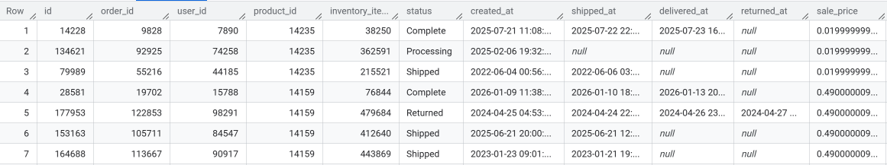
    *  users: Includes Information about each customer
        *  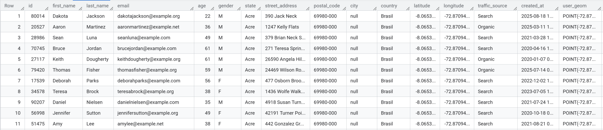
    *  products: Includes details about the products sold by the company
        * 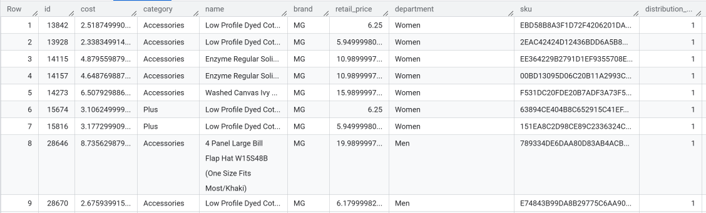

I applied the following query to these tables to create my formatted table. My notes for each part of the query are included in the sql code:

```sql
WITH 
Spend AS 
      (SELECT
        user_id,
        sum(coalesce(order_total,0)) AS Total_Spend,
        avg(order_total) AS avg_order_spend
       FROM
        (SELECT
          user_id,
          order_id,
          sum(coalesce(sale_price,0)) AS order_total
        FROM
          bigquery-public-data.thelook_ecommerce.order_items
        WHERE
          status <> 'Cancelled'
          GROUP BY
            user_id,
            order_id)
      GROUP BY
        user_id)
    /*Spend creates an order table that calculates the total price of each order (excluding cancelled orders) in the order_items table.
The order table has one row for each order. It shows the user id for each order as well.
The outer query calculates the total spend and average spend per customer based on the temporary inner table. */,
Last_Purchase AS 
      (SELECT
        DATE_DIFF(CURRENT_DATE(), DATE(MAX(created_at)), DAY) AS days_since_last_purchase,
        user_id
       FROM
            bigquery-public-data.thelook_ecommerce.order_items
        WHERE
          status <> 'Cancelled'
          GROUP BY
            user_id)
      /*Last_Purchase finds the difference between the maximum created date and the current date for each order (excluding cancelled) in the order_items table and groups by user id to show the days since last purchase for each user*/,
Country AS
      (SELECT
        *
        FROM
        (SELECT
          id,
          country,
          1 AS flag
         FROM
          bigquery-public-data.thelook_ecommerce.users
        )
        PIVOT (max(flag) FOR country IN ( 'Brasil',  'Japan',  'United States',  'Colombia',  'Spain',  'China',  'Australia',  'France',  'Germany',  'Belgium',  'South Korea',  'Poland',  'United Kingdom',  'Deutschland',  'Austria'
)))
      /*Country uses a one hot method do represent customer countries. It starts by creating a table that has a user id column and a country coumn. Each time the query finds a match between a user id and a country, it puts a 1 in the corresponding cell. Pivot the flips the data and creates a new table with one column per country. The maximum value in the list of country columns for each user is marked in the corresponding country column for that user. The query groups by user id by default.*/,
Category AS 
      (SELECT
       *
       FROM
       (SELECT
        o.user_id,
        p.category,
        1 AS flag
        FROM
          bigquery-public-data.thelook_ecommerce.order_items o
        LEFT JOIN
          bigquery-public-data.thelook_ecommerce.products p
        ON
         o.product_id = p.id 
        WHERE
          o.status <> 'Cancelled'
        )
        PIVOT
          (SUM(flag) FOR Category IN( 'Accessories', 'Plus', 'Swim', 'Active', 'Socks & Hosiery', 'Socks', 'Dresses', 'Pants & Capris', 'Fashion Hoodies & Sweatshirts', 'Skirts', 'Blazers & Jackets', 'Suits', 'Tops & Tees', 'Sweaters', 'Shorts', 'Jeans', 'Maternity', 'Sleep & Lounge', 'Suits & Sport Coats', 'Pants', 'Intimates', 'Outerwear & Coats', 'Underwear', 'Leggings', 'Jumpsuits & Rompers', 'Clothing Sets')))
      /*Category joins the products and order items tables so that we can reference the product categories for each purchase. It then uses a one hot method by flagging each instance where a user id makes a purchase from a given category. It, then, creates a table with one column per category that shows the number of times that each user makes a purchase from each category.*/
SELECT 
          ANY_VALUE( CASE WHEN Lower(u.gender) = 'female' THEN 1
          WHEN Lower(u.gender) = 'male' THEN 0
          ELSE NULL
          END) AS Gender,
      /*Creates a Gender column that marks a 1 for females and a 0 for males*/
        ANY_VALUE(u.age) AS age,
      /*Records the customer's age in the age column*/
        COUNT(DISTINCT(o.order_id)) AS Order_Count,
      /*Counts orders placed*/
        ANY_VALUE(s.avg_order_spend) AS avg_order_spend,
      /*Pulls average order spend from the spend table created above*/
        sum(coalesce(o.sale_price,0)) AS total_spend,
      /*Pulls the sum of total spend from the order_items table*/
                          COALESCE(ANY_VALUE(co.Brasil),0) AS Brasil,
                          COALESCE(ANY_VALUE(co.Japan),0) AS Japan,
                          COALESCE(ANY_VALUE(co.`United States`),0) AS United_States,
                          COALESCE(ANY_VALUE(co.Colombia),0) AS Colombia,
                          COALESCE(ANY_VALUE(co.Spain),0) AS Spain,
                          COALESCE(ANY_VALUE(co.China),0) AS China,
                          COALESCE(ANY_VALUE(co.Australia),0) AS Australia,
                          COALESCE(ANY_VALUE(co.France),0) AS France,
                          COALESCE(ANY_VALUE(co.Germany),0) AS Germany,
                          COALESCE(ANY_VALUE(co.Belgium),0) AS Belgium,
                          COALESCE(ANY_VALUE(co.`South Korea`),0) AS South_Korea,
                          COALESCE(ANY_VALUE(co.Poland),0) AS Poland,
                          COALESCE(ANY_VALUE(co.`United Kingdom`),0) AS United_Kingdom,
                          COALESCE(ANY_VALUE(co.Deutschland),0) AS Deutschland,
                          COALESCE(ANY_VALUE(co.Austria),0) AS Austria,
                        /*Pulls the country column and corresponding value of 0 or 1 (1 if the user is from that country) from the country table created above*/

        ANY_VALUE(lp.days_since_last_purchase) AS days_since_last_purchase,
                          COALESCE(ANY_VALUE(c.Accessories), 0) AS Accessories,
                          COALESCE(ANY_VALUE(c.Plus), 0) AS Plus,
                          COALESCE(ANY_VALUE(c.Swim), 0) AS Swim,
                          COALESCE(ANY_VALUE(c.Active), 0) AS Active,
                          COALESCE(ANY_VALUE(c.`Socks & Hosiery`), 0) AS Socks_Hosiery,
                          COALESCE(ANY_VALUE(c.Socks), 0) AS Socks,
                          COALESCE(ANY_VALUE(c.Dresses), 0) AS Dresses,
                          COALESCE(ANY_VALUE(c.`Pants & Capris`), 0) AS Pants_Capris,
                          COALESCE(ANY_VALUE(c.`Fashion Hoodies & Sweatshirts`), 0) AS Fashion_Hoodies_Sweatshirts,
                          COALESCE(ANY_VALUE(c.Skirts), 0) AS Skirts,
                          COALESCE(ANY_VALUE(c.`Blazers & Jackets`), 0) AS Blazers_Jackets,
                          COALESCE(ANY_VALUE(c.Suits), 0) AS Suits,
                          COALESCE(ANY_VALUE(c.`Tops & Tees`), 0) AS Tops_Tees,
                          COALESCE(ANY_VALUE(c.Sweaters), 0) AS Sweaters,
                          COALESCE(ANY_VALUE(c.Shorts), 0) AS Shorts,
                          COALESCE(ANY_VALUE(c.Jeans), 0) AS Jeans,
                          COALESCE(ANY_VALUE(c.Maternity), 0) AS Maternity,
                          COALESCE(ANY_VALUE(c.`Sleep & Lounge`), 0) AS Sleep_Lounge,
                          COALESCE(ANY_VALUE(c.`Suits & Sport Coats`), 0) AS Suits_Sport_Coats,
                          COALESCE(ANY_VALUE(c.Pants), 0) AS Pants,
                          COALESCE(ANY_VALUE(c.Intimates), 0) AS Intimates,
                          COALESCE(ANY_VALUE(c.`Outerwear & Coats`), 0) AS Outerwear_Coats,
                          COALESCE(ANY_VALUE(c.Underwear), 0) AS Underwear,
                          COALESCE(ANY_VALUE(c.Leggings), 0) AS Leggings,
                          COALESCE(ANY_VALUE(c.`Jumpsuits & Rompers`), 0) AS Jumpsuits_Rompers,
                          COALESCE(ANY_VALUE(c.`Clothing Sets`), 0) AS Clothing_Sets
                        /*Pulls the category column and the sum of purchases made from each category from the category table created above.*/
      FROM
        bigquery-public-data.thelook_ecommerce.users u
      LEFT JOIN
        bigquery-public-data.thelook_ecommerce.order_items o
      ON
        u.id = o.user_id
      /*Joins the users and order_items tables based on records where the user id's match*/
      LEFT JOIN
        bigquery-public-data.thelook_ecommerce.products p
      ON
        o.product_id = p.id
      /*Joins order_items and products tables on records where the product id's match*/
      LEFT JOIN
        Category c
      ON
        c.user_id = u.id
      /*Joins the category table created above and the user table on records where the user id's match*/
      LEFT JOIN
        Country co
      ON
        co.id = u.id
      /*Joins the country table created above and the user table on records where the user id's match.*/
      LEFT JOIN
        Last_Purchase lp
      ON
        LP.user_id = u.id
      /*Joins the last purchase table created above and the user table on records where the user id's match*/
      LEFT JOIN
        Spend s
      ON
        s.user_id = u.id
      /*Joins the spend table created above and the user table on records where the user id's match*/
      WHERE
        o.status <> 'Cancelled'
      GROUP BY
        u.id
      /*Groups all data in the final product by user id*/
```
This creates the following table. I have hidden all but 2 country columns and all but 2 category columns to simplify:
* 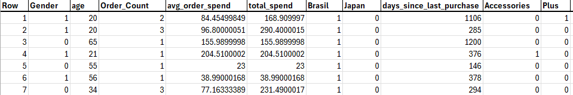

### Elbow Method
For a successful k means analyses, it is imperative that I choose the right number of centroids. As I run the model with an increasing number of centroids, the mean squarred distance from the data points to their corresponding cluster will decrease. However, as I add centroids, the insights become more complex for my stakeholders. More specifically, 10 customer groups is just way too many customer groups to keep track of while 3 or 4 is much more manageable. I use the elbow method to determine when the rate of msd (mean squarred distance) decrease slows down drastically. The centroid number at which the slow down occurs will be the optimal number of centroids for the analyses. To begin, I saved the formatted table to Big Query and applied the following query to it. This runs the k means analyses with the number of centroids specified. The query code includes my description of each step. I ran with 2, 3, 4, 5, 6, 7, 8, 9, and 10 centroids. I saved the results of each model to big query:

```sql
CREATE OR REPLACE MODEL
  `linear-facet-257019.the_look_ecommerce_k_means.k_means_test`
  /*The name of the final result*/
OPTIONS
  (
    MODEL_TYPE = 'KMEANS',
  /*Big Query's function for k means analyses*/
    NUM_CLUSTERS = 2, 
  /*The number of centroids to use*/
    STANDARDIZE_FEATURES = TRUE 
  /*Scales features being considered by the model. For example, a user's average order spend could be 100 but their country is only 1. Standardizing prevents the model from assigning more weight to the order spend than the country value. */
  ) AS
SELECT
  Gender,
  age,
  Order_Count,
  avg_order_spend,
  total_spend,
  Brasil,
  Japan,
  United_States,
  Colombia,
  Spain,
  China,
  Australia,
  France,
  Germany,
  Belgium,
  South_Korea,
  Poland,
  United_Kingdom,
  Deutschland,
  Austria,
  days_since_last_purchase,
  Accessories,
  Plus,
  Swim,
  Active,
  Socks_Hosiery,
  Socks,
  Dresses,
  Pants_Capris,
  Fashion_Hoodies_Sweatshirts,
  Skirts,
  Blazers_Jackets,
  Suits,
  Tops_Tees,
  Sweaters,
  Shorts,
  Jeans,
  Maternity,
  Sleep_Lounge,
  Suits_Sport_Coats,
  Pants,
  Intimates,
  Outerwear_Coats,
  Underwear,
  Leggings,
  Jumpsuits_Rompers,
  Clothing_Sets
FROM
  `linear-facet-257019.the_look_ecommerce_k_means.formatted_table_k_means`
/*Pulls the columns from the original table for the model to analyze*/
```
I ran the following query on each of the models to find the mean squared distance for each number of centroids:
```sql
SELECT
  *
  FROM
    ML.EVALUATE(MODEL `linear-facet-257019.the_look_ecommerce_k_means.k_means_test`)
```
I created a table in excel with the the columns: Centroids, Mean Squared Distance, Normalized Points, Normalized Distance, and Straight Y. Below is the table and a description of each column:
* 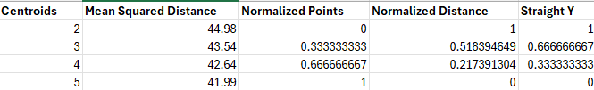
   * Centroids: The number of centroids
   * Mean Squared Distance: The mean squared distance that the model retured for each number of centroids.
   * Normalized points: In cell c2 I put the formula =(A2-$A$2)/($A$5-$A$2) and dragged it to autofill the cells below. This formula calculates the distance from the minimum and divides it by the difference between the minimum and maximum. This allows me to plot the point values on a standard scale for a visual.
   * Normalized distance: I apply the same logic that I applied to the Normalized Points column to the Mean Squared Distance column with the formula =(B2-$B$5)/($B$2-$B$5). This allows me to plot mean squared distance on the same visual.
   * Straight Y: The goal of this column is to create values that draw a straight line from my first plotted centroid to my last plotted centroid. I do this with the formula =(C2*-1)+1. This creates the y coordinate for each normalized centroid number by subtracting the normalized centroid number from 1.
   * I plot this table using the following chart:
      * 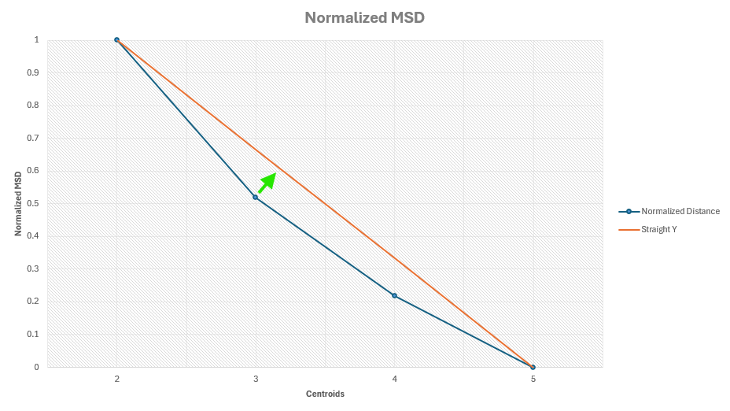
         * The arrow shows that the distance between centroid 3 and the nearest point on the straight line is the greatest. Therefore, this is where the most drastic slow down in cluster tightening occurs. I will move forward with my analyses using 3 centroids.

### Centroid Assignment
I assigned each customer in my formatted table to their centroid using the following query:
```sql
SELECT 
  * Except(nearest_centroids_distance)
FROM
  ML.PREDICT
    (MODEL `linear-facet-257019.the_look_ecommerce_k_means.k_means_test_3`, 
      (SELECT
        *
      FROM
       `linear-facet-257019.the_look_ecommerce_k_means.formatted_table_k_means`))
```
### Power BI Analyses
#### Centroid Group Size
* I want to show my stakeholders how many customers fall within each centroid group. I started by creating 3 measures that count the number of centroids in each group. The dax code for the group 1 measure is shown below. The measures for groups 2 and 3 follow the same format, but are applied to their group.
   * 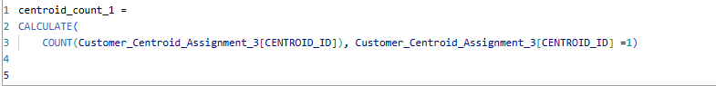
* Power BI does not allow sufficient control over the visual if I merely create a bar graph and drag these measures in to the visual directly. Therefore, I will need to create a table and apply a switch measure that replaces the table values with the measures above. Below is the table I created manually to start this process. I created this using the "enter data" option in Power BI.
   * 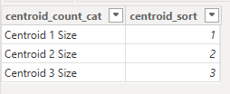
* Then, I applied the following switch measure to the manually created table. Most of the visuals within this project were created using the same method. Moving forward, I will call this the "switch method"
   * 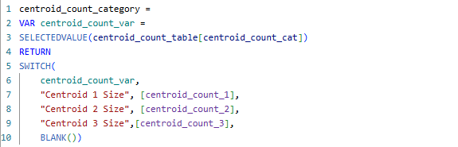
* I created a bar chart, dragged the switch measure to the y-axis, and dragged the centroid category from the manually created table to the x-axis. I formatted the chart by color coding the bars, adding data labels, changing the title and labeling each axis. Below is the resulting chart. It shows that the centroid groups order from largest to smallest:
   * 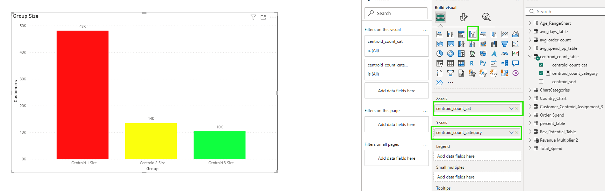
* I split my report in to 5 pages. The group size chart above goes in the size page of the report:
   * 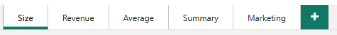

#### Total Spend Per Group
* I want to show my stakeholders the total amount that has been spent by each group. I use the same switch method applied to group size above. I start by creating a total spend measure for each group:
   * 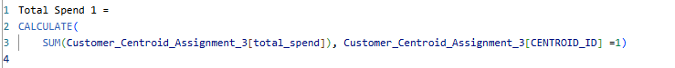
* I create a table with the total spend category values:
   * 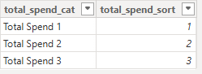
* I apply the following total spend switch measure to this table:
   * 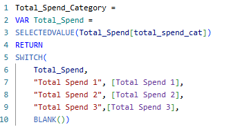
* I pull the total spend switch measure to the y-axis and the total spend category to the x-axis. After formatting, below is the resulting table. It shows that group 1 (the largest centroid group) spends the most. However, group 3 (the smallest centroid group) is not far behind. I keep my group color-coding consistent throughout my report. This chart goes on the revenue page of the report. 
   * 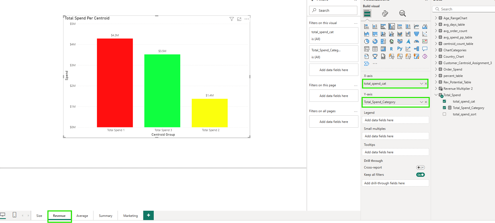

#### Purchase Behavior
* I want to show my stakeholders the average spend per person, average spend per order, average number of orders per person, and the average days since last purchase for the customers in each group. 

##### Avg. Spend Per Person
* I create an average spend per person measure for each group. These measures create a total spend variable (the total spend when the data is filtered to the specified group), at total person count variable (the count of users when the data is filtered to the specified group), and then divide the total spend variable by the total person count variable:
   * 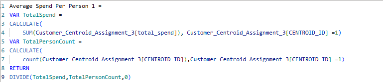
* I start the switch method by creating and average spend per person category table:
   * 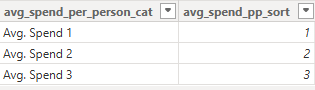
* I apply an average spend per person swith measure to the table:
   * 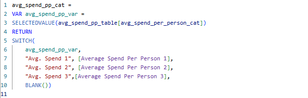
* I drag the average spend per person switch measure to the y axis and the table category to the x axis. After formatting, the chart below shows that centroid group 3 spends the most money per person:
   * 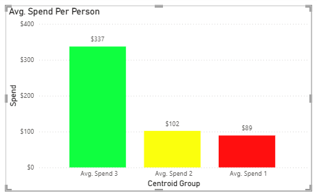

##### Avg. Order Spend
* I create an average order spend measure for each group:
   * 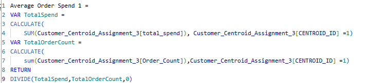
* I create a category table for the swith method:
   * 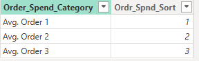
* I apply an average order spend switch measure to the table:
   * 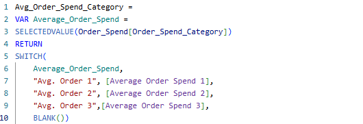
* I apply the switch measure to a bar chart and format the bar chart to get the following visual. This shows that group 3 has the largest average order spend:
   * 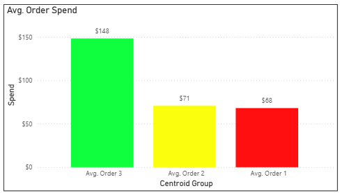

##### Avg. Number of Orders Per Person
* I create and average number of orders per person measure for each group. This counts the number of orders for the group specified as a total order count variable, counts the number of customers in that group as a customer count variable and then divides the order count variable by the customer count variable:
   * 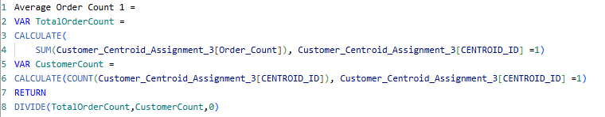
* I create an average order count table for the switch method:
   *  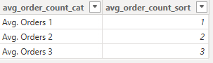
*  I create an average order count switch measure:
   *  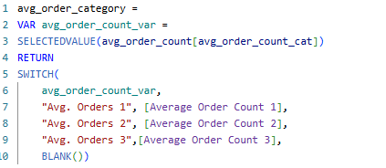
*  I apply this measure to a bar chart and format the visual. This shows that group 3 places the most orders per person:
   * 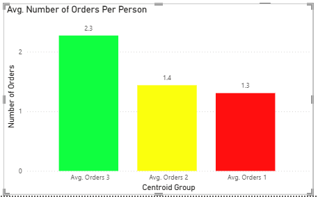

##### Avg. Days Since Last Purchase
* I create the a measure that shows average days from last purchase for each group. This measure calculates total days from the days since last purchase column of the data for each group and stores it in a variable, counts the customers per group and stores it in a variable, and then divides the total days variable by the customer count variable:
   * 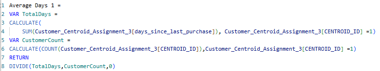
* I create the average days table for the switch method:
   * 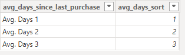
* I created a days since last purchase switch measure:
   * 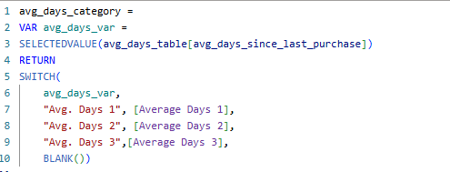
* I applied the switch measure to a bar graph and formatted the following visual. This shows that group 3 customers make purchases most frequently:
   * 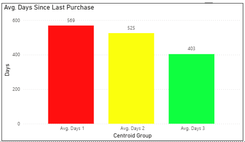

##### Purchase Behavior Final Report Page
* Below is the final report page that I will share with my stakeholders. The visuals show that centroid group 3 spends the most per person, spends the most per order, and places the most orders per person. The average customer in group 3 also places orders more frequently than the other groups:
   * 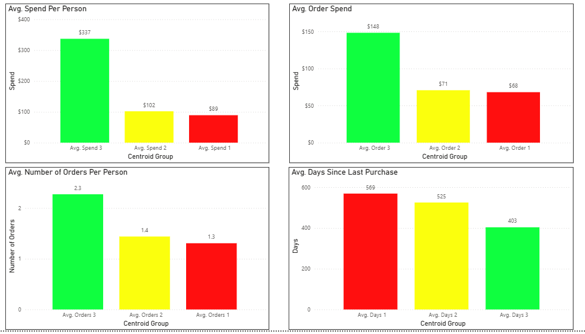

##### Revenue Potential
* I want to summarize the insights found from analyzing the customer purchase behaviors using a visual for my stakeholders. The visual will be a bar chart with one bar per centroid group. The size of these bars will be controlled by a toggle that adds a specified number of customers to all of the groups. The bars will show how much revenue is added when each of the groups grow by the amount of people specified in the toggle.
   * To create this visual, I started by creating the customers added toggle. I did this using the new parameter funtion in Power BI:
      * 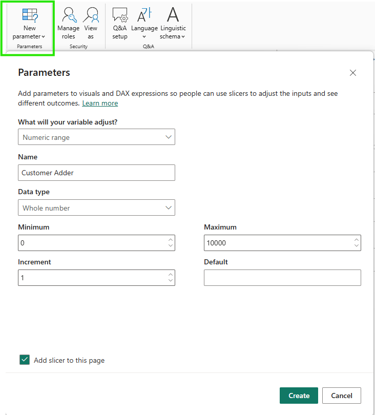
   * Then, I created a revenue portential measure for each group by executing the steps below.
      * create a person count variable which is the count of customers when the data is filtered the specified centroid id.
      * create a current rev variable which is sum of total spend when the data is filtered to the specified centroid id.
      * create and average spend variable: divide the current rev variable by the person count variable.
      * create an additional rev variable: multiply the average spend variable by the amount specified in the toggle.
      * return the additional rev variable value.
      * 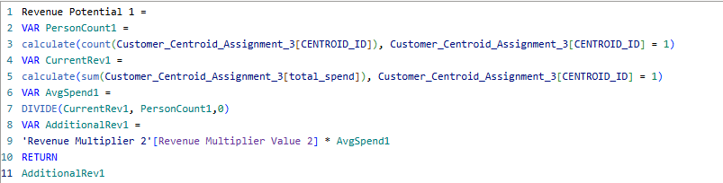
   * After executing these steps for all three centroid groups, I created a revenue potential table for the switch method:
      * 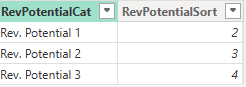
   * Finally, I applied the following switch measure to the table:
      * 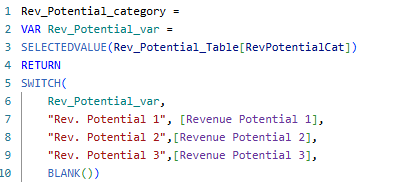
   * I applied this measure to a bar graph and formatted the visual as shown in the video below. This highlights that the company will grow their revenue more quickly if they increase the size of group three than they will if they increase the size of the other groups. 
      * [](https://youtu.be/Po5_Bo22NQU)

#### Marketing
* Now that my stakeholders know it would make business sense to increase the size of group 3, I will show them the key characteristics of group 3. This will help them begin an effective marketing campaign. I will create a marketing page within the report that shows the gender distribution, age distribution, percentage of purchases from each category, and geographic distribution for each of the groups. The visuals on this page will be controlled by a slicer that changes the visuals to reflect the chosen group.

##### Slicer 
* I create the slicer and drag the Centroid id column name from the data set in to the field:
   * 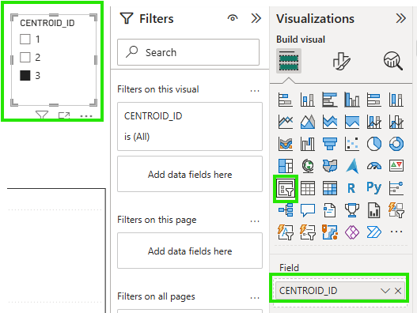

##### Gender
* I will show the gender distribution for centroid group 3:
   *  I start by creating the following measure for males and females in the specified group. THis measure creates a total id variable that count the customers when then centroid id column is filtered to the selected value in the slicer, creates a gender count variable that counts the customers when the centroid id is equal to the value in the slicer and gender column is filtered to the applicable gender, and divides the gender count variable by the total id variable:
      *  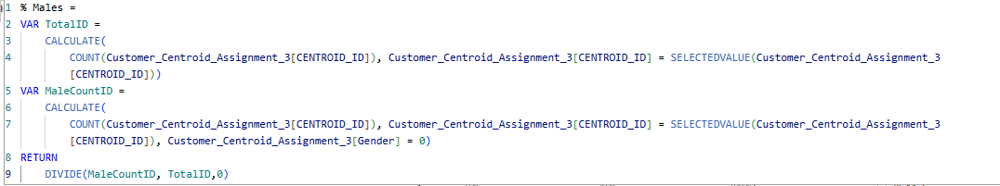
   *  I create a pie chart visual and drag the female and male measures in to the value field:
      *  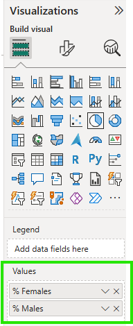
   *  This results in the following visual which shows that group 3 is made up of 82.7% males and 17.3% females:
      *  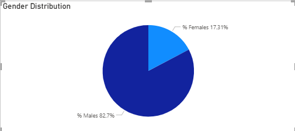

##### Age
* I will create a bar chart that shows the age distribution for each group:
   * The customers within this data set are ages 12-70. I will split them in to 10 year ranges. I create measures for each age range. These measures create a variable that counts the number of customers when the data is filtered to the cetroid id specified in the slicer and the age falls within the applicable range, a variable that counts the total customers when the data is filtered to the group chosen in the slicer, and divides the age range count variable by the total count variable. This what percentage of customers from the chosen group fall within each age range:
      * 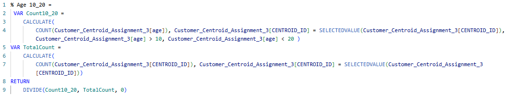
   * Then, I create an age category table for the switch method:
      * 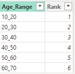
   * I apply a switch measure to the age category table:
      * 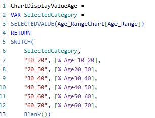
   * I create a bar chart, pull the switch measure to the x-axis, the age category to the y-axis, and format the visual. This results in the following chart. It shows an even distribution of ages for group 3:
      * 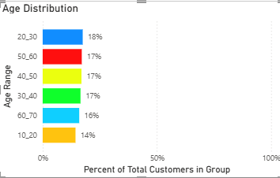

##### Purchase Categories
* I will create a bar chart that shows what percentage of purchases fell in to each category per group:
   * The data set includes 27 product categories. I reduce this to 10 sub categories for simplification as shown below:
      * 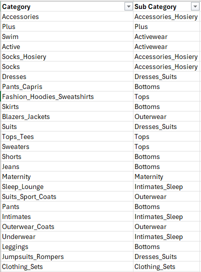
   * I create 10 measures like the one below for bottoms. This measure creates a variable called categorycount which filters the data to the chosen centroid group in the slicer and then sums the purchase categories where each of the applicable sub categories are listed. Then, it creates a total item variable which sums all of the items purchased when the data is filtered to the centroid id selected in the slicer. Last, the measure divides the category count variable by the total item count variable. This shows the percentage of items that the selected group purchased which fell within the applicable category:
      * 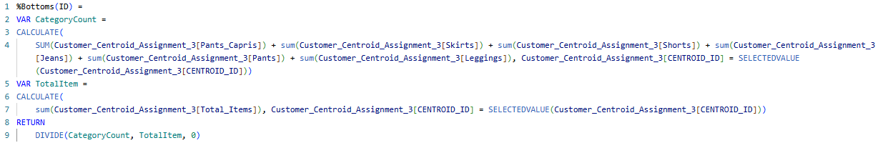
   * Manually repeating the measure creation process above for 10 category measure was too tedious. Therefore, I created an excel table and used concatenate to create the measures. As shown below, I put the sub categories incolumns A-F, the new category name in column G, and each measure component in columns I-K. The measure components were similar across all of the measures so these could be easily autofilled to the cells below. The only difference between the measures was the sub category names. Once the table was filled with this data, I applied this concatenate formula: =CONCAT(H5,G5,I5,F5,J5,E5,J5,D5,K5) to the bottoms category row and autofilled the other cells in the concat column. The snip below shows the table contents for the bottoms and dresses_suits categories:
      * 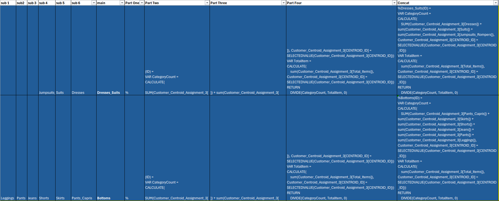
   * Once the measures were created, I prepared for the switch method by creating a switch table for the categories:
      * 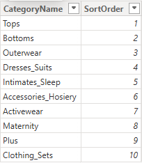
   * I applied the following switch measure to the table:
      * 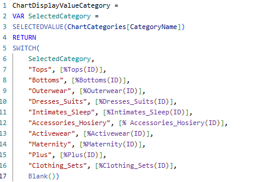
   * I applied the switch measure to a bar chart and formatted the visual. This resulted in the visual below. This shows that centroid group 3 (shown in the centroid slicer on the report page) purchases most items from the bottoms category. They also make a significant portion of purchases from the topa and outerwear categories:
      * 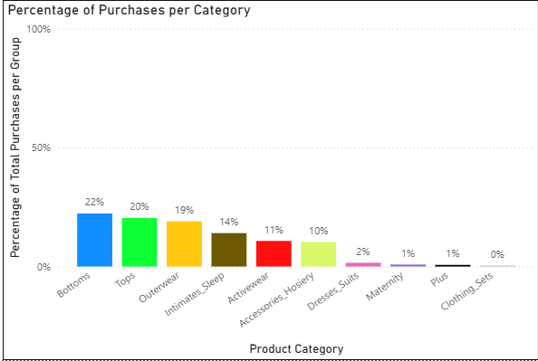

##### Countries
* I will create a bar chat that shows what percentage of customers from each group are from a given country. I will follow use the same measure creation method that I used for the purchase categories to create the measures for the countries. The country measures will be easier since they do not involve sub categories. I will start by filling an excel table with the country names and measure parts. I will apply the concatenate formula to create the measures for each country as shown below:
   * 
* I create the measures in Power BI for each country like the one shown below for China:
   * 
* I created a country table for the switch method:
   * 
* I appllied the following switch measure to this table:
   * 
* I applied the switch measure to a bar chart and formatted the visual. This resulted in the chart below. It shows that centroid group 3 (shown in the centroid slicer on the report page) is made up of mostly people who are from China or the U.S.
   * 

##### Marketing Report Page
* Below is the final maketing page of the report for centroid group 3. The video shows how a stakeholder can interact with the visuals by using the slicer:
   * 
   * [](https://youtu.be/rantKFGpvyY)

 ### Final Insight
 * I would recommend that my stakeholders attempt to increase the size of centroid group 3 since the company makes the most profit off of these customers. Group 3 is made up of mostly males in China and the U.S. They are evenly distributed accross all age groups. They mostly spend their money on bottoms, tops, and outerwear. Therefore, the company should market these products to these groups. 


<br><br><br><br><br><br><br><br><br><br><br><br><br><br><br><br><br><br><br><br><br><br><br><br><br><br><br><br><br><br><br><br><br>

## Coursera Case Study
I analyze the data of Fitbit users to derive marketing insights for my stakeholders. This is a case study for my Google Data Analytics Certificate. To complete this task, I used the 6 step data analyses process outlined in the course: ask, prepare, process, analyze, share, act. 
### Prompt
* You are a data analyst for a company called Bellabeat. Bellabeat makes wearable fitness devices.
* Your team has been asked to anazlyze trends in smart fitness device usage in an effort to help Bellabeat reach their target market more effectively.
* A data set about Fitbit users is provided by the company.
* Questions:
    * What are some trends in smart device usage?
    * How could these trends apply to Bellabeat's customers?
    * How could these trends influence Bellabeat's marketing strategy?
### Phase One: Ask
* Are users wearing the watch as a fashionable accessory? Do they wear it all day?
* Do users frequently log their weight in the device?
* What time of day do users typically exercise?
* How far do users go per day?
* How much sleep do the users get per night?
### Phase Two: Prepare
* Is the data reliable?
    * For purposes of this case study, I will use the dataset provided. However, it is important to note the we are trying to make a claim about Fitbit users. Therefore, our population would be 38.5 million people. If we wanted to make claims about this population with 95% certainty, we would need a sample size of at least 385 participants. If this were a real life scenario, I would recommend that we find a more representative data set.
    * Further, the source of this data is Amazon Mechanical Turk. Therefore, this dataset is not random and it was not vetted for bias.
* Is the data the original set?
    * Yes
* Is the data comprehensive?
    * The data includes enough information to allow us to answer our questions about the users included.
* Is the data current?
    * This data set is updated annually.
### Phase Three and Four: Process and Analyze
* Are users wearing the watch as a fashionable accessory? Do they wear it all day?
    * For this task, I used the heartrate_seconds_merged.csv tables. There is one for the first date range (3/12-4/11), and one for the second date range (4/12-5/12). A preview of this table is shown below. A user must be wearing the watch for their heartrate to be tracked. Therefore, this table will show us how long each user wears their watch:
    * 
    * First, I cleaned this data by formatting the id’s to a number and expanded the date row to include all information.
    * Second, I uploaded the tables to Bigquery.
    * Third, I applied the following steps to the datasets for both date ranges:
         * I found the number of days that each user was wearing their fitbit during the date range.
            * To do this, I applied the following SQL query to the heartrate table:
            * 
            * Below is the table created by this query:
            * 
                 * I then ran the following query on the table above to find the total number of days per user during the range:
                 * 
                 * Below is the table that resulted from running this query:
                 * 
         * Now that I knew the total number of days per user for this date range, I needed to find the number of hours that each user wore the watch during the date range.
            *  To do this, I ran the following query on the original heart rate table:
            *  
            *  This resulted in the following table with the start and end time on each day for each user:
            *  
            *  Then, I ran the following query on the table above to add the total duration per user:
            *  
            *  This resulted in the following table:
            *  
            *  I joined this table with the day count table using the following query:
            *  
            *  This resulted in a table that showed the Fitbit Id, total days the fitbit was used, and the total hours the fitbit was used. Below is a snip of the table for the 3/12-4/11 dataset:
            *  
         * Since I applied these steps to both date ranges, I ended up with 2 tables.
            * I combined these tables in Excel.  
            * In a new tab, I used a sumif function to total the number of hours per user in one column and the number of days per user in another.
               * I added a third column that divides the hours used by the days used to find each user's average daily use.
            * In a new sheet, I created a table that used a countif function to add the number of users that fell within each usage range as shown below:
            *  
            * I used Excel to create a chart from this table as shown below:
            * 
   * This chart shows us that most Fitbit users wear their watch between 12 and 24 hours per day. My recommendation to my stakeholders would be to market their product to users who are looking for a fashionable watch that they can wear all day, not just while working out.
* How often are users utilizing the weight log function?
   * To answer this, I prepared the weight log data sets by extracting the date from the column with Date-Time using flash fill in Excel. Then, I used the following sql query to merge the two tables, and count the number of distinct id’s that fell within each date range. This showed the number of unique user Id's that used the weight log each week. I chose to measure this on a weekly basis because this is a common weigh in frequency for someone who is trying to lose weight.
   * 
   * This query created a table that I opened in Excel. In Excel, I added a percentage column that divided the number of unique users each week by the population size (30), and created a chart that plotted the weekly percentages on a line graph as shown below:
   * 
   * The chart above shows that only a very small percentage of our population is using the weight log function. Based on this data, I would recommend that we investigate why this function is not being used. It could mean that only a small percentage of our population is trying to lose weight. Alternatively, it could mean that the weight log funtion is not easy to use. We could search for datasets that shed light on the percentage of Fitbit users that use the device for weight loss or create a survey that attempts to uncover how Fitbit users feel about the weight log function. This information could provide valuable insight about whether or not we should market to people who are trying to lose weight. Depending on what we find, it could also mean a step toward improving the weight log function for our device.
* What time of day do users exercise?
   * To answer this question, I used the hourly calories tables for both date ranges.
      * I started by opening these tables in Excel. Then, I extracted the hour from the date-hour column using flash fill.
      * Then, I downloaded the tables in to Bigquery and ran the following query on them:
      * 
      * The query above combines the datasets from both date ranges, averages the calories for each hour, and groups the results by hour. I opened this table in Excel and created the following graph:
      * 
   * Our population burns the most calories at 7PM each day. Based on this information, I would recommend that my stakeholders market to working professionals. Our advertisements could be timed to get the most visibility by showing them in gyms at 7PM or, right after, when these users are coming home from the gym. This information could also inform decisions about the watch design. It might make sense to create a watch that can be worn while at work so that users do not need to remember to put it on before leaving for their workout.
* How far do users go per day?
   * To answer this question, I used the daily activity datasets. These tables show the distance that each user went each day. There is one table for the date range 3/12-4/11 and one for 4/12-5/12. I wanted to make sure there weren't duplicate dates for any one user. To do this, I applied the following query to each of the tables:
   * 
   * This confirmed that there weren't duplicate dates for any user. If there were duplicate dates per user, I would have to sum the distances for each date. 
   * Then, I ran the following query to combine the data sets from both ranges, find the average distance per user, and then count the number of users that fell within each distance range:
   * 
   * I downloaded the table that this query created in Excel and made the folowing graph to show how many users fell within each kilometer range for an average day:
   * 
* Most users fall between 0-9 Km per day. The majority of users travel 3-6 Km per day. The daily activity table also has a column that shows sedentary distance. This column typicaly shows a 0 or a very small number. This means that most of the distance being tracked is active distance. Therefore, we can assume that the users are traveling these distances for their workouts or, at the very least, walking. We could use this information to market to runners or walkers that usually travel this distance. We could also design a watch that is user friendly for runners and walkers and has an effective mileage tracker.
* How much sleep do users get per night?
   * To answer this question, I ran the following query on the sleep minutes table:
   * 
   * This produced a dataset that I downloaded in to Tableau. There, I created the following viz:
   * 
   * Most users get between 5-9 hours of sleep per night. 23/30 users wore their watch to bed in this dataset. This shows that the sleep tracking function is used by the majority of Fitbit users. Bellabeat should have a sleep tracking feature and market this feature to their users.
### Phase 5 and 6: Share and Act
* Are users wearing the watch as a fashionable accessory? Do they wear it all day?
   * 
   * Yes, most users wear their watch all day. I recommend that we market our product to users who are looking for a fashionable watch. We should also make sure our watch is fashionable enough to be worn all day.
* Do users frequently log their weight in the device?
   * 
   * Only a very small percentage of Fitbit users use the weight log function. Further investigation is needed to find out why. This may not be a strong area of focus for our product until that investigation is done. 
* What time of day do users typically exercise?
   * 
   * Users burn the most calories at 7PM each day. I would recommend that we market to working professionals with this time frame in mind. We should also create a watch that fits a professional dress code to accommodate these users.
* How far do users go per day?
   * 
   * Most users fall between 0-9 Km per day. We should design a watch that is user friendly for runners and walkers and has an effective mileage tracker.
* How much sleep do the users get per night?
   * 
   * Most users get between 5-9 hours of sleep per night. 23/30 users wore their watch to bed in this dataset. Bellabeat should have a sleep tracking feature and market this feature to their users.

[Home](#sam-metz-data-portfolio)

<br><br><br><br><br><br><br><br><br><br><br><br><br><br><br><br><br><br><br><br><br><br><br><br><br><br><br><br><br><br><br><br><br>


## Priority Sort
I use Google Sheets to sort tasks based on priority creating a dynamic todo list that always brings the highest priority task to the top.

### Methodology
A task's priority is determined by it's importance category (where does the task come from), its effort level, and its due date. 

### Priority Sort Design
* Set up 2 tabs. Tab one is the actual to do list calculator that will sort tasks. Tab 2 is the points tab.
   * The points tab contains 3 separate tables: Importance table, effort table, and urgency table.
      * Importance: what category does this task fall in to? rank these categories from most to least important 
         * Assign each category an importance letter and a point value. Lower points result in higher priority rank
      * Effort: how complex is the task? how much time will it take?
         * Rank these complexity categories from least to most effort and assign a point value to each complexity category. The less complex the lower the points and higher priority.
      * Due Date: set urgency preferences: As a due date approaches, the point value decreases and the task becomes higher priority. My preference is that due date has the most impact on priority.
         * 
   * The Sort Calculator tab setup:
      * Urgency Point Column setup:
         * The due date is entered manually for each task.
            * Once the due date is entered, They Day left column calculates the number of days left using the formula: =F2 - TODAY(). This finds the difference between the current date and the due date. The day left column is formatted as a whole number.
            * 
               * The urgency column assigns an urgency category based on the number of days left until the due date using formula: =IF(G2<=0,1, IF(G2<=3,2,IF(G2<=5,3,IF(G2<=20,4,5)))) as shown below. If the day left column contains a value less than or equal to 0 then it returns 1. If the day left column contains a value that is less than or equal to 3 then it returns 2. If the day left column contains a value that is less than or equal to 5 then it returns a 3. If the day left column contains a value that is less than or equal to 20 then it return 4. Otherwise, it returns a value of 5.
               * 
                  * The urgency point column looks up a point value by referencing the value in the urgency column and returning the corresponding point value from the urgency table in the points tab using formula: =VLOOKUP(E2,Points!I:J,2,FALSE) as shown below:
                     * 
      * Effort Point Column Setup:
         * The effort is entered manually for each task.
            * The effort point column looks up the effort point value by referencing the value entered in the effort column in the effort table of the points tab using formula: =VLOOKUP(D2,Points!E:F,2,FALSE) as shown below:
            * 
      * Importance Point Column Setup:
         * The Importance category is entered manually for each task
            * The importance point column looks up the importance point value by referencing the value entered in the importance column in the importance table of the points tab using formula: =VLOOKUP(C2,Points!A:B,2,FALSE) as show below:
            * 
      * Priority Column Setup:
         * The priority column adds all of the points columns using formula: =SUM(H2:J2) as shown below:
         * 
      * Sorting:
         * Autofill all formulas to the cells below them
         * Sort the entire table by the priority column lowest to highest
         * The tasks that are sorted to the top of the list are the tasks that need to get done first
         * Edit the point values and categories to match your preferences.           

[Home](#sam-metz-data-portfolio)


<br><br><br><br><br><br><br><br><br><br><br><br><br><br><br><br><br><br><br><br><br><br><br><br><br><br><br><br><br>

## Family Olympics Scoreboard


